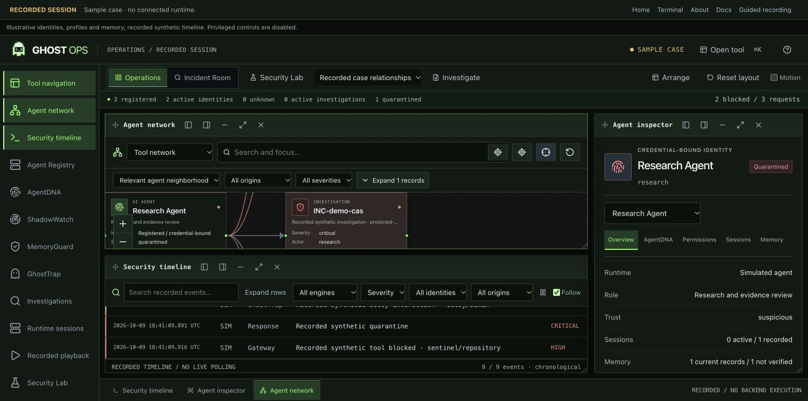
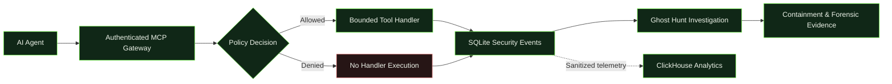
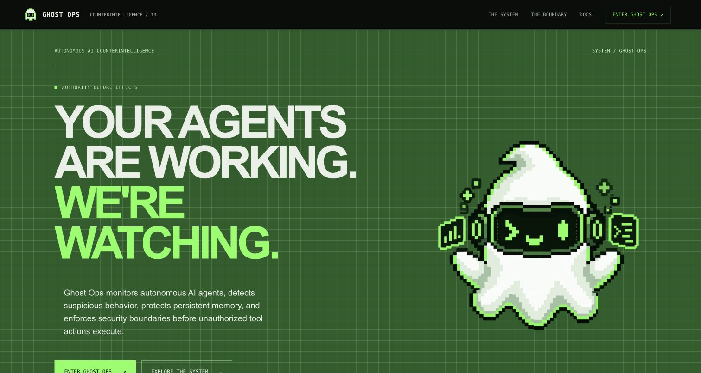
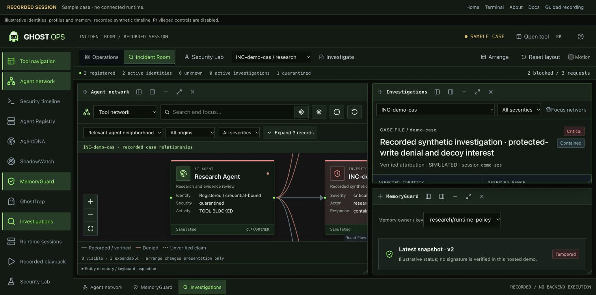
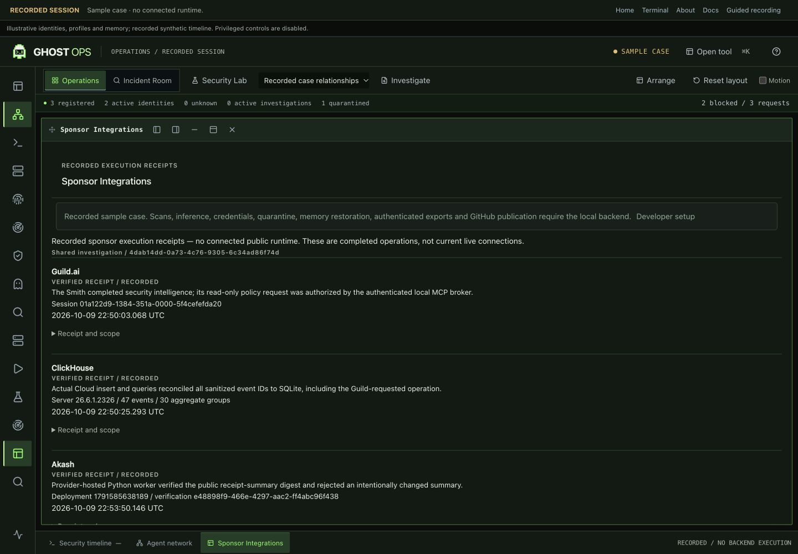

<p align="center">
  
</p>

<h1 align="center">GHOST OPS</h1>

<p align="center"><strong>Detect the rogue. Trace the behavior. Protect the memory.</strong></p>

<p align="center">
  Autonomous AI counterintelligence. Verify tool requests, investigate suspicious behavior, protect persistent memory and preserve an inspectable evidence trail.
</p>

<p align="center">
  <a href="https://github.com/Muzzy5150/ghost-ops"></a>
  <a href="https://ghost-ops-pi.vercel.app"></a>
</p>

<p align="center">
  
  
  
  
</p>

<p align="center">
  
  
  
</p>

<p align="center">
  <a href="https://ghost-ops-pi.vercel.app/terminal/">Open Workstation</a> ·
  <a href="#core-capabilities">Capabilities</a> ·
  <a href="#how-it-works">Architecture</a> ·
  <a href="#verified-sponsor-executions">Sponsor Evidence</a> ·
  <a href="#quick-start">Quick Start</a> ·
  <a href="#documentation">Documentation</a>
</p>

<p align="center">
  
</p>

<p align="center"><em>Operations: an interactive agent network, movable windows and an inspectable security timeline.</em></p>

## Overview

Ghost Ops checks authenticated agent tool requests before supported operations execute. Its local MCP gateway enforces identity, session, credential, tool, resource and containment boundaries. SQLite preserves decisions and evidence; the workstation connects behavioral signals, memory integrity and investigations.

> [!NOTE]
> The [public workstation](https://ghost-ops-pi.vercel.app/terminal/) uses clearly labeled recorded and simulated data. Actual enforcement runs locally. Public provisioning, quarantine, restoration, scans, inference and publishing are disabled.

## Core Capabilities

| Capability | What it does |
| --- | --- |
| **AgentDNA** | Compares authenticated activity with behavioral baselines and explains deviations. |
| **ShadowWatch** | Verifies identity and permissions; records rogue-agent indicators. |
| **MemoryGuard** | Signs memory content and provenance; inspects versions and verified restoration. |
| **GhostTrap** | Uses inert synthetic decoys to gather evidence of interest. |
| **Ghost Hunt & Response** | Correlates cross-agent evidence and enforces scoped containment. |
| **MCP gateway** | Authorizes bounded handlers before effects; denied requests do not execute. |
| **Web Sentinel** | Retrieves approved security intelligence and preserves source references. |
| **Forensic evidence** | Checks export integrity and authentication under explicit local-key trust. |

## How It Works



The gateway and SQLite are authoritative. Sponsor intelligence, analytics and public digest checks support investigations; they do not grant permissions.

## Inside the Workstation

### The system



### Investigation and memory integrity



*Public sample case: recorded chronology and illustrative memory state, with privileged actions disabled.*

## Verified Sponsor Executions

Completed executions from the shared local investigation on **2026-10-09**:

| Technology | Actual result | Scope |
| --- | --- | --- |
| **Guild.ai** | The Smith completed investigator session `01a122d9-1384-351a-0000-5f4cefefda20`; its policy read was authorized. | Operator-mediated, bounded local bridge. |
| **ClickHouse** | Cloud insert and query reconciled **47 event IDs** to SQLite; **30 aggregate groups**, server **26.6.1.2326**. | Sanitized telemetry; analytics do not decide authorization. |
| **Akash** | Deployment `1791585638189` verified the shared receipt-summary digest and rejected an altered summary. | Digest consistency, not private signer authenticity. |



Badges describe verified completed executions, not current live connections. [Submission evidence and limitations](docs/FINAL_SUBMISSION.md).

## Technology

TypeScript, Next.js 16, React 19, Tailwind CSS, React Flow and Dagre. The local platform uses Prisma/SQLite, Zod and the official MCP SDK. Vercel hosts `apps/website`, reusing workstation presentation components. SDK and MCP proxy packages live in `packages/`.

## Quick Start

Use Node.js 24 and npm in a fresh clone:

```sh
git clone https://github.com/Muzzy5150/ghost-ops.git
cd ghost-ops
npm ci
npm run setup
npm run sdk:build
npm run dev -- --port 3210
```

Open `http://127.0.0.1:3210`. Setup initializes demo data; use isolated state rather than an existing investigation database. Offline operation needs no paid service or model credentials. Use the provided server wrapper for administrative transport authority.

## Security Scope

Enforcement applies to supported **gateway-routed operations**, not arbitrary OS activity. Behavioral and honeypot signals are evidence to investigate, not proof of malicious intent. Host or signing-key compromise defeats local evidence authentication. External transfers and model inference require explicit opt-in.

## Documentation

- [Guide index and repository map](docs/README.md)
- [Architecture](docs/ARCHITECTURE.md)
- [Developer SDK](docs/DEVELOPER_SDK.md)
- [Hosted workstation and backend roadmap](docs/HOSTED_WORKSTATION.md)
- [Security boundaries](docs/SECURITY.md)
